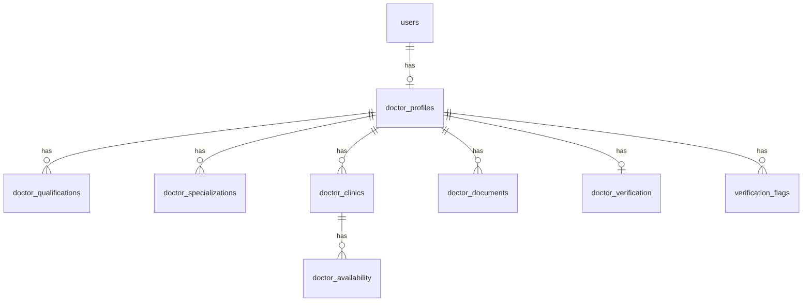

# Doctor Onboarding & Verification System — Implementation Plan

## Overview

Build a complete Doctor Onboarding and Verification System for PraDoc. After registration and OTP verification, doctors complete a 6-step profile wizard. An automated scoring engine evaluates completeness and either auto-approves, flags for review, or rejects. Fraud detection checks run on every submission.

This integrates with the existing auth system (`User` model, JWT tokens, `get_doctor` dependency) without breaking any current functionality.

---

## Existing Codebase Summary

| Layer | Current State |
|---|---|
| **User model** | `users` table with `id`, `full_name`, `email`, `mobile`, `role`, `is_verified`, `is_active` |
| **Auth** | Register → OTP → Login flow, JWT access/refresh tokens |
| **Dependencies** | `get_current_user`, `require_role()`, `get_doctor` |
| **Frontend** | React 18 + Vite + axios, auth pages (Login, Register, OTP), placeholder dashboards |
| **Database** | Async SQLAlchemy + asyncpg, `create_tables()` on startup |
| **API pattern** | `/api/v1/auth/*`, router composition in `app/api/v1/router.py` |

---

## Database Schema (9 Tables)



### Table Definitions

#### 1. `doctor_profiles`
| Column | Type | Notes |
|---|---|---|
| `id` | UUID PK | |
| `user_id` | UUID FK → users.id | UNIQUE |
| `profile_photo` | String(500) | File path |
| `gender` | Enum(male, female, other) | |
| `date_of_birth` | Date | |
| `languages_spoken` | ARRAY(String) | e.g. `["English", "Hindi"]` |
| `bio` | Text | Professional about me |
| `medical_registration_number` | String(100) | UNIQUE |
| `medical_council` | String(200) | From predefined list |
| `registration_year` | Integer | |
| `years_of_experience` | Integer | |
| `current_hospital` | String(300) | |
| `previous_hospitals` | ARRAY(String) | Optional |
| `primary_specialization` | String(200) | |
| `council_verification_status` | Enum | NOT_VERIFIED / VERIFIED / FAILED |
| `council_verified_at` | DateTime | Nullable |
| `council_reference_id` | String(200) | Nullable |
| `profile_completion_pct` | Integer | 0–100 |
| `is_profile_complete` | Boolean | Default false |
| `created_at` / `updated_at` | DateTime | Auto-managed |

#### 2. `doctor_qualifications`
| Column | Type |
|---|---|
| `id` | UUID PK |
| `doctor_profile_id` | UUID FK |
| `qualification_type` | Enum (MBBS, BDS, BHMS, BAMS, MD, MS, DM, MCh, DNB, OTHER) |
| `college_name` | String(300) |
| `university_name` | String(300) |
| `graduation_year` | Integer |
| `created_at` | DateTime |

#### 3. `doctor_specializations`
| Column | Type |
|---|---|
| `id` | UUID PK |
| `doctor_profile_id` | UUID FK |
| `specialization_name` | String(200) |
| `is_primary` | Boolean |

#### 4. `doctor_clinics`
| Column | Type |
|---|---|
| `id` | UUID PK |
| `doctor_profile_id` | UUID FK |
| `clinic_name` | String(300) |
| `address` | Text |
| `city` | String(100) |
| `state` | String(100) |
| `pincode` | String(10) |
| `consultation_fee` | Numeric(10,2) |
| `online_consultation` | Boolean |
| `online_consultation_fee` | Numeric(10,2) | Nullable |
| `clinic_verification_status` | Enum | PENDING / VERIFIED / FAILED |
| `clinic_verified_at` | DateTime | Nullable |
| `created_at` / `updated_at` | DateTime |

#### 5. `doctor_availability`
| Column | Type |
|---|---|
| `id` | UUID PK |
| `clinic_id` | UUID FK → doctor_clinics.id |
| `day_of_week` | Enum (MON–SUN) |
| `start_time` | Time |
| `end_time` | Time |
| `is_active` | Boolean |

#### 6. `doctor_documents`
| Column | Type |
|---|---|
| `id` | UUID PK |
| `doctor_profile_id` | UUID FK |
| `document_type` | Enum (MEDICAL_REG_CERT, DEGREE_CERT, PROFILE_PHOTO, CLINIC_PROOF, GST_CERT, RENT_AGREEMENT, UTILITY_BILL) |
| `file_path` | String(500) |
| `file_hash` | String(128) | SHA-256 for duplicate detection |
| `original_filename` | String(300) |
| `file_size` | Integer |
| `uploaded_at` | DateTime |
| `verification_status` | Enum (PENDING, VERIFIED, REJECTED) |

#### 7. `doctor_verification`
| Column | Type |
|---|---|
| `id` | UUID PK |
| `doctor_profile_id` | UUID FK | UNIQUE |
| `verification_status` | Enum (PENDING, UNDER_REVIEW, APPROVED, REJECTED, SUSPENDED) |
| `verification_score` | Integer | 0–100 |
| `score_breakdown` | JSON | `{"registration": 20, "qualification": 20, ...}` |
| `reviewed_by` | UUID FK → users.id | Nullable (admin) |
| `reviewed_at` | DateTime | Nullable |
| `rejection_reason` | Text | Nullable |
| `created_at` / `updated_at` | DateTime |

#### 8. `verification_flags`
| Column | Type |
|---|---|
| `id` | UUID PK |
| `doctor_profile_id` | UUID FK |
| `flag_type` | Enum (DUPLICATE_REG_NUMBER, DUPLICATE_DOCUMENT, INVALID_GRADUATION_YEAR, EXPERIENCE_EXCEEDS_AGE, DUPLICATE_EMAIL, DUPLICATE_MOBILE) |
| `severity` | Enum (WARNING, CRITICAL) |
| `description` | Text |
| `is_resolved` | Boolean |
| `resolved_by` | UUID FK | Nullable |
| `resolved_at` | DateTime | Nullable |
| `created_at` | DateTime |

---

## Proposed Changes

### Backend — Models

#### [NEW] [doctor.py](file:///d:/python%20FullStack/pradoc/backend/models/doctor.py)
All 8 new SQLAlchemy models in a single file: `DoctorProfile`, `DoctorQualification`, `DoctorSpecialization`, `DoctorClinic`, `DoctorAvailability`, `DoctorDocument`, `DoctorVerification`, `VerificationFlag`. Includes all enums (Gender, QualificationType, DocumentType, VerificationStatus, DayOfWeek, FlagType, etc.). Adds relationship back-refs to `User` model.

#### [MODIFY] [__init__.py](file:///d:/python%20FullStack/pradoc/backend/models/__init__.py)
Export all new models.

---

### Backend — Schemas

#### [NEW] [doctor.py](file:///d:/python%20FullStack/pradoc/backend/schemas/doctor.py)
Pydantic V2 schemas for each step:
- `PersonalInfoCreate/Update/Response`
- `ProfessionalInfoCreate/Update/Response`
- `QualificationCreate/Response` (supports list)
- `SpecializationCreate/Response`
- `ClinicCreate/Update/Response`
- `AvailabilityCreate/Response`
- `DocumentResponse`
- `VerificationResponse`
- `DashboardResponse` (profile completion %, score, missing items)
- `DoctorPublicProfile` (what patients see)

---

### Backend — Repository Layer

#### [NEW] [doctor_repo.py](file:///d:/python%20FullStack/pradoc/backend/repositories/doctor_repo.py)
Data access layer with methods:
- `create_profile()`, `get_profile_by_user_id()`, `update_personal_info()`, `update_professional_info()`
- `add_qualification()`, `delete_qualification()`, `get_qualifications()`
- `set_specializations()`, `get_specializations()`
- `create_clinic()`, `update_clinic()`, `get_clinics()`
- `set_availability()`, `get_availability()`
- `create_document()`, `get_documents()`, `get_document_by_hash()`
- `create_or_update_verification()`, `get_verification()`
- `create_flag()`, `get_flags()`
- `get_verified_doctors()` (for patient search — visibility rules)

---

### Backend — Service Layer

#### [NEW] [doctor_service.py](file:///d:/python%20FullStack/pradoc/backend/services/doctor_service.py)
Business logic:
- `save_personal_info()` — create/update profile step 1
- `save_professional_info()` — step 2 + duplicate reg number check
- `save_qualifications()` — step 3 + graduation year validation
- `save_specializations()` — step 4
- `save_clinic_info()` — step 5
- `upload_document()` — step 6 + file hash + duplicate detection
- `calculate_verification_score()` — scoring engine
- `run_fraud_checks()` — all automated checks, creates flags
- `get_dashboard()` — aggregates completion %, score, missing items
- `get_public_profile()` — for patients (visibility rules enforced)

#### [NEW] [file_service.py](file:///d:/python%20FullStack/pradoc/backend/services/file_service.py)
- `save_upload()` — saves file to `uploads/<doctor_id>/`, returns path
- `compute_file_hash()` — SHA-256
- Designed for future S3 swap (abstract interface)

---

### Backend — API Endpoints

#### [NEW] [doctor.py](file:///d:/python%20FullStack/pradoc/backend/app/api/v1/doctor.py)

| Method | Endpoint | Description |
|---|---|---|
| `GET` | `/doctor/profile` | Get current doctor's full profile |
| `PUT` | `/doctor/profile/personal` | Step 1: Personal info |
| `PUT` | `/doctor/profile/professional` | Step 2: Professional info |
| `POST` | `/doctor/profile/qualifications` | Step 3: Add qualification |
| `DELETE` | `/doctor/profile/qualifications/{id}` | Remove a qualification |
| `PUT` | `/doctor/profile/specializations` | Step 4: Set specializations |
| `POST` | `/doctor/profile/clinics` | Step 5: Add clinic |
| `PUT` | `/doctor/profile/clinics/{id}` | Update clinic |
| `PUT` | `/doctor/profile/clinics/{id}/availability` | Set availability slots |
| `POST` | `/doctor/profile/documents` | Step 6: Upload document |
| `DELETE` | `/doctor/profile/documents/{id}` | Remove document |
| `POST` | `/doctor/profile/submit` | Submit for verification |
| `GET` | `/doctor/dashboard` | Dashboard data |
| `GET` | `/doctor/public/{doctor_id}` | Public profile (patients) |
| `POST` | `/doctor/profile/photo` | Upload profile photo |

All doctor-only endpoints use `get_doctor` dependency.

#### [MODIFY] [router.py](file:///d:/python%20FullStack/pradoc/backend/app/api/v1/router.py)
Include the new doctor router.

---

### Backend — Configuration

#### [MODIFY] [config.py](file:///d:/python%20FullStack/pradoc/backend/core/config.py)
Add `UPLOAD_DIR` setting (default: `./uploads`).

#### [MODIFY] [.env](file:///d:/python%20FullStack/pradoc/backend/.env)
Add `UPLOAD_DIR=./uploads`.

---

### Frontend — Multi-Step Wizard

#### [NEW] [doctorApi.js](file:///d:/python%20FullStack/pradoc/frontend/src/api/doctorApi.js)
API client for all doctor endpoints.

#### [NEW] [DoctorOnboarding.jsx](file:///d:/python%20FullStack/pradoc/frontend/src/pages/doctor/DoctorOnboarding.jsx)
Main wizard container with step indicator and navigation.

#### [NEW] Step Components (in `src/pages/doctor/steps/`)
- `PersonalInfoStep.jsx` — photo upload, name, gender, DOB, languages, bio
- `ProfessionalInfoStep.jsx` — reg number, council dropdown, experience
- `QualificationsStep.jsx` — dynamic add/remove qualification cards
- `SpecializationsStep.jsx` — primary + multi-select secondary
- `PracticeInfoStep.jsx` — clinic form + availability scheduler
- `DocumentsStep.jsx` — drag-and-drop file uploads with status indicators

#### [MODIFY] [DoctorDashboard.jsx](file:///d:/python%20FullStack/pradoc/frontend/src/pages/doctor/DoctorDashboard.jsx)
Replace placeholder with full dashboard: completion ring, score bar, status badge, missing items checklist, approval progress.

#### [MODIFY] [App.jsx](file:///d:/python%20FullStack/pradoc/frontend/src/App.jsx)
Add route `/doctor/onboarding` for the multi-step wizard.

#### [NEW] [doctor-onboarding.css](file:///d:/python%20FullStack/pradoc/frontend/src/pages/doctor/doctor-onboarding.css)
Premium styles for the wizard, dashboard, and all step components.

---

## Automated Verification Scoring Engine

```
┌────────────────────────────────────┬────────┐
│ Criterion                          │ Points │
├────────────────────────────────────┼────────┤
│ Registration Number Provided       │   +20  │
│ Qualification Added                │   +20  │
│ Registration Certificate Uploaded  │   +30  │
│ Degree Certificate Uploaded        │   +20  │
│ Clinic Information Added           │   +10  │
├────────────────────────────────────┼────────┤
│ Total                              │  100   │
└────────────────────────────────────┴────────┘

Score ≥ 80  →  AUTO APPROVE
Score 50–79 →  UNDER_REVIEW (manual review)
Score < 50  →  REJECTED
```

The engine runs automatically on each profile submission (`/doctor/profile/submit`).

---

## Fraud Detection Checks

Run automatically during submission:

1. **Duplicate Registration Number** — query `doctor_profiles` for existing reg number owned by another user
2. **Duplicate Document Hash** — SHA-256 match across `doctor_documents` from other profiles
3. **Invalid Graduation Year** — graduation year > current year, or graduation year < 1950
4. **Experience > Age** — `years_of_experience > (current_year - birth_year - 22)` (minimum MBBS age)
5. **Duplicate Email/Mobile** — already handled by `users` table unique constraints

Each detected issue creates a `verification_flags` entry with severity level.

---

## File Upload Strategy

- **Development**: Save to `backend/uploads/<doctor_uuid>/<document_type>_<timestamp>.<ext>`
- **Future S3**: Replace `file_service.py` implementation; file paths become S3 keys
- **Allowed types**: `.jpg`, `.jpeg`, `.png`, `.pdf` 
- **Max size**: 5MB per file
- **Hash**: SHA-256 computed before save for duplicate detection

---

## Doctor Visibility Rules

Patients can only see doctors where ALL conditions are met:
```python
User.is_verified == True
User.is_active == True
DoctorVerification.verification_status == "APPROVED"
DoctorProfile.is_profile_complete == True
```

---

## Verification Plan

### Automated Tests
1. Start backend with `uvicorn main:app --reload` — verify no import errors
2. Check all tables created by hitting `/health` endpoint
3. Test each API endpoint via `/docs` Swagger UI
4. Frontend: `npm run dev` → navigate to doctor onboarding flow

### Manual Verification
1. Register a doctor account → verify OTP → redirected to onboarding wizard
2. Complete all 6 steps → verify dashboard shows 100% completion
3. Submit for verification → verify auto-approval with score ≥ 80
4. Upload duplicate documents → verify fraud flags are created
5. Try duplicate registration number → verify rejection

---

## Open Questions

> [!IMPORTANT]
> **Alembic migrations**: The current codebase uses `create_tables()` on startup. Should I continue with auto-creation (simpler for development), or set up Alembic migration infrastructure? I recommend continuing with `create_tables()` for now since you're in development mode.

> [!NOTE]
> **Profile photo in Step 1 vs Step 6**: The requirements list profile photo in both personal info (Step 1) and verification documents (Step 6). I'll handle it as: Step 1 stores the display photo on the profile, Step 6 stores a formal verification copy. Both can be the same file.

> [!NOTE]
> **Login redirect flow**: After a doctor logs in with an incomplete profile, I'll redirect them to the onboarding wizard automatically. They can't access the main dashboard until profile is submitted.
